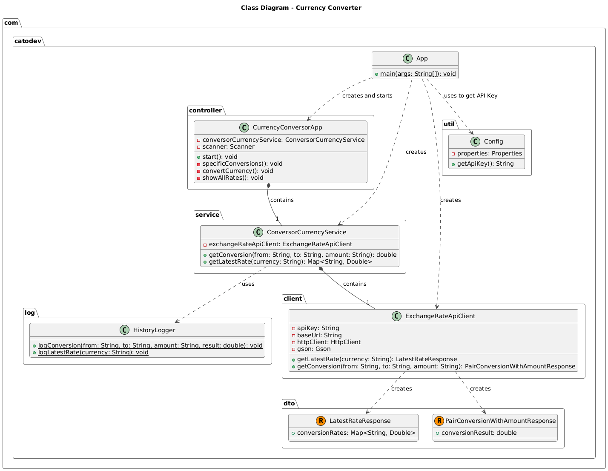

# ONE Challenge - Currency Converter


This project is a simple command-line application for currency conversion, developed as part of the "ONE Challenge - Java - Back end" program. It allows users to convert amounts between different currencies using real-time exchange rates from the ExchangeRate-API.

## Features

The application offers an interactive command-line interface with the following options:

- **Specific Conversions:** A menu with 6 predefined options for the most common conversions between `USD`, `ARS`, `BRL`, and `COP`.
- **Universal Converter:** Allows real-time currency conversion between any two currency codes supported by the API.
- **View All Rates:** Fetches and displays all the latest exchange rates for a given base currency.
- **Conversion History:** Automatically logs every conversion made by the user into a `conversion_history.txt` file in the project's root directory.

## Implemented API Endpoints

The application uses two main endpoints from the [ExchangeRate-API](https://www.exchangerate-api.com/):

### 1. Pair Conversion

- **Endpoint:** `/pair/<CURRENCY_FROM>/<CURRENCY_TO>/<AMOUNT>`
- **Sample URL:** `https://v6.exchangerate-api.com/v6/YOUR_API_KEY/pair/USD/ARS/100`
- **Application Usage:** This endpoint is used in the "Specific Conversions" and "Universal Converter" features to get the result of a direct conversion between two currencies for a specific amount.

### 2. Latest Rates

- **Endpoint:** `/latest/<BASE_CURRENCY>`
- **Sample URL:** `https://v6.exchangerate-api.com/v6/YOUR_API_KEY/latest/USD`
- **Application Usage:** This endpoint is used in the "View All Rates" feature to retrieve the latest exchange rates for all other currencies relative to a single base currency.

## Getting Started

### Prerequisites
- Java 17 or higher
- Apache Maven

### How to Run

1.  **Clone the repository:**
    
    With HTTPS protocol:
    ```bash
    git clone https://github.com/your-username/one-challenge-currency-conversor.git
    cd one-challenge-currency-conversor
    ```
    
    With SSH protocol:

    ```bash
    git clone git@github.com:your-username/one-challenge-currency-conversor.git
    cd one-challenge-currency-conversor
    ```

2.  **Get an API Key:**
    - Sign up at [ExchangeRate-API](https://www.exchangerate-api.com/) to get a free API key.

3.  **Configure the API Key:**
    - Create a file named `config.properties` inside the `src/main/resources/` directory.
    - You can use `src/main/resources/config.properties.example` as a template.
    - Open `config.properties` and replace `your_api_key` with your actual API key.
    - **Important:** The `config.properties` file is already listed in `.gitignore` to prevent committing your API key to version control.

4.  **Build the project:**
    - From the project's root directory, run:
    ```bash
    mvn clean package
    ```

5.  **Run the application:**
    ```bash
    java -jar target/one-challenge-currency-conversor-1.0-SNAPSHOT.jar
    ```

## Project Structure and Architecture



### File & Directory Explanations

- **`pom.xml`**: The **Project Object Model** file for Maven. It defines the project's dependencies (like Google's `Gson` for JSON parsing), build configurations, and plugins required to compile and package the application into an executable JAR file.

- **`src/main/`**: This directory contains the main source code and resources for the application.
    - **`java/`**: The root for all Java source code, organized by packages.
    - **`resources/`**: Contains non-code files.
        - `config.properties.example`: A template file showing users how to structure the `config.properties` file needed to store the API key.

- **`src/test/`**: Contains all testing code. The structure mirrors the `main` source directory.
    - `AppTest.java`: A basic test class provided by the Maven archetype.

- **`target/`**: This directory is created by Maven during the build process. It contains the compiled bytecode (`.class` files) and the final packaged application (`.jar` file). This directory is temporary and can be deleted (`mvn clean`).

- **`.gitignore`**: A Git configuration file that specifies which files and directories to ignore in version control. This is crucial for excluding sensitive data (like `config.properties`), build outputs (`target/`), and IDE-specific files.

### Class-level Architecture

- #### `com.catodev.App`
  - **Responsibility:** The main entry point of the application (`main` method).
  - **Function:** Its only task is to instantiate all necessary classes (Config, ApiClient, Service, Controller) and start the application's main loop by calling the controller's `start()` method. This approach is a form of manual **Dependency Injection**, where a class's dependencies are created externally and "injected" through its constructor.

- #### `com.catodev.controller.CurrencyConversorApp`
  - **Responsibility:** Acts as the **Controller** or presentation layer. It handles all user interaction through the command line.
  - **Function:** It displays menus, captures user input (which currencies to convert, the amount, etc.), and based on that input, calls the appropriate methods in the `ConversorCurrencyService`. Once the service returns a result, this class is responsible for formatting and presenting it to the user.

- #### `com.catodev.service.ConversorCurrencyService`
  - **Responsibility:** The **Service Layer**, containing the core business logic.
  - **Function:** It orchestrates operations. It receives requests from the controller, calls the `ExchangeRateApiClient` to fetch data from the external API, and then invokes the `HistoryLogger` to record the transaction. It decouples the application logic from the direct API interaction and user presentation.

- #### `com.catodev.client.ExchangeRateApiClient`
  - **Responsibility:** Acts as an **HTTP Client** specialized for the ExchangeRate-API. It is the only class that knows how to communicate with the API.
  - **Function:** It builds the URLs for the specific endpoints (`/pair` and `/latest`), executes the HTTP requests, and uses the `Gson` library to deserialize the JSON responses into DTOs. It also handles communication errors.

- #### `com.catodev.dto`
  - **Classes (actually Records):** `LatestRateResponse.java`, `PairConversionWithAmountResponse.java`
  - **Responsibility:** These are **Data Transfer Objects (DTOs)**. Their sole purpose is to model the structure of the JSON responses from the API.
  - **Function:** They are used as templates so `Gson` can automatically convert the JSON text into typed Java objects (in this case, Java Records), making it easy and safe to access the response data.

- #### `com.catodev.log.HistoryLogger`
  - **Responsibility:** A utility class for recording a history of all conversions.
  - **Function:** Provides a static `logConversion` method that formats a string with the conversion details and appends it to the `conversion_history.txt` file.

- #### `com.catodev.util.Config`
  - **Responsibility:** Manages application configuration, primarily the API key.
  - **Function:** Loads the `config.properties` file from the resources directory and exposes a method to get the value of the `api.key` property, preventing the key from being hardcoded in the source.


## Technologies Used

- **Java 17**
- **Apache Maven:** For project build and dependency management.
- **Google Gson:** For parsing JSON responses from the API.

## Demo

https://github.com/user-attachments/assets/a6c44efd-a00a-4602-97f0-04b4c9d6e2af

## License

This project is licensed under the MIT License. See the [LICENSE](LICENSE) file for details.

---
